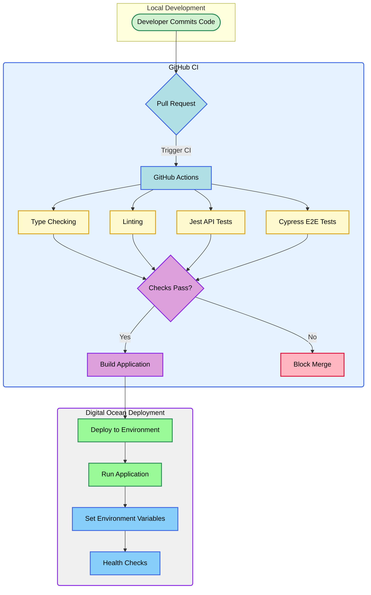

# Deployment Configuration <!-- omit in toc -->

This document details the deployment configuration and build pipeline for Truck Scout TMS.

- [Overview](#overview)
  - [Build Pipeline](#build-pipeline)
- [CI/CD Pipeline Visualization](#cicd-pipeline-visualization)
- [Deployment Process](#deployment-process)
- [Environment Configuration](#environment-configuration)
- [Deployment Workflow](#deployment-workflow)
- [Reference](#reference)

## Overview

Our deployment infrastructure consists of several key components working together:

### Build Pipeline
1. GitHub Repository
   - Source code storage
   - Branch protection rules
   - PR workflows

2. Digital Ocean App Platform
   - Automated builds from GitHub
   - Environment-specific deployments
   - Resource management
   - Environment variable management

3. Database Management
   - PostgreSQL database
   - Connection string management
   - Migration handling

## CI/CD Pipeline Visualization

## Deployment Process

The deployment process consists of four key stages:

1. **Local Development**
   - Developers work in feature branches
   - Local testing using `npm run test:local:all`
   - Code changes committed and pushed to GitHub

2. **Continuous Integration**
   - GitHub Actions triggered on Pull Request
   - Automated checks:
     * Type checking
     * Linting
     * Jest API tests
     * Cypress E2E tests
   - Build process using Node.js 20.x
   - Caching of dependencies and build artifacts

3. **Build and Deployment**
   - Successful PRs trigger build process
   - Application built using `npm run build`
   - Deployment to Digital Ocean App Platform
   - Environment-specific variables injected
   - Zero-downtime deployment strategy

4. **Post-Deployment**
   - Automated health checks
   - Performance monitoring
   - Error reporting enabled

## Environment Configuration

The application uses Digital Ocean's App Platform with the following key environment variables:

- `NODE_ENV`: Production environment indicator
- `DATABASE_URL`: PostgreSQL connection string
- `NEXT_PUBLIC_API_URL`: API endpoint configuration
- `ENVIRONMENT`: Deployment environment identifier
- `BRANCH_NAME`: Source control branch reference

**Runtime Configuration**:
- Production server started via `npm start`
- Runs on Node.js 20.x
- Serves on port 3000

## Deployment Workflow

1. **Code Submission**
   - Feature branch development
   - Pull request creation
   - CI/CD pipeline automatically triggered

2. **Validation**
   - Comprehensive automated testing
   - Build process verification
   - Environment variable validation

3. **Deployment**
   - Container build
   - Environment configuration
   - Service deployment
   - Comprehensive health checks

4. **Monitoring**
   - Continuous performance tracking
   - Error reporting
   - Proactive alerting

## Reference

- [Digital Ocean App Platform Documentation](https://docs.digitalocean.com/products/app-platform/)
- [Next.js Deployment Documentation](https://nextjs.org/docs/deployment)
- [PostgreSQL Configuration Guide](https://docs.digitalocean.com/products/databases/postgresql/)
