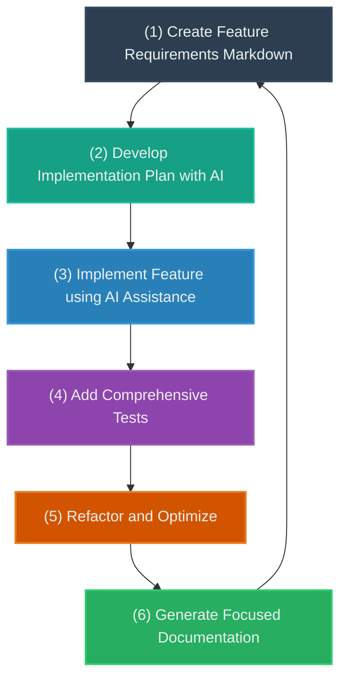

# Documentation Driven Development with AI Pair Programming

## Overview

Documentation Driven Development (DDD) is an innovative software development approach that leverages AI as a pair programmer, drawing inspiration from Extreme Programming (XP) principles. This methodology emphasizes documentation as the primary driver of development, using AI agents to transform documentation into functional software.

## Core Principles

### 1. Documentation as the Starting Point
- Begin each feature by creating a comprehensive markdown document
- Describe entities, business rules, and end-user expectations in detail
- Use documentation to establish a clear, shared understanding of the feature

### 2. AI-Assisted Development Plan
- Collaborate with an AI agent to break down the feature into granular tasks
- Create a structured development plan within the documentation
- Prioritize tasks: API development, testing, UI implementation

### 3. Feature Implementation
- Use the AI agent to implement the feature based on the documented requirements
- Leverage the detailed documentation as a precise specification
- Ensure alignment between documentation and implementation

### 4. Test-Driven Development
- Focus on testing "what" the application does, not "how" it does it
- Write tests that validate the documented requirements
- Use tests to enable confident refactoring, following XP principles

### 5. Continuous Refinement
- Iteratively improve code patterns and implementation
- Rely on comprehensive test coverage to support refactoring
- Maintain small, focused documentation files for easy AI context management

## Benefits
- Enhanced clarity of requirements
- Improved collaboration between human developers and AI
- Systematic approach to feature development
- Reduced ambiguity in software specifications
- Easier knowledge transfer and onboarding

## Best Practices
- Keep documentation files small and focused
- Use consistent naming conventions (e.g., `-bp` suffix for best practices)
- Maintain a clear separation of concerns in documentation
- Regularly update documentation to reflect current implementation

## Example Workflow
1. Create feature requirements markdown
2. Develop implementation plan with AI
3. Implement feature using AI assistance
4. Add comprehensive tests
5. Refactor and optimize
6. Generate focused documentation files

## Tools and Technologies
- Markdown for documentation
- AI Pair Programming Tools (e.g., Aider, Cursor)
- Comprehensive testing frameworks
- Version control systems

## Continuous Improvement
This approach is experimental and evolving. We welcome feedback and contributions to refine the Documentation Driven Development methodology.
